This repo is a centralized place to put all proto related files for the given project. 

This includes the generated code that should be imported from this repo instead of copy-pasting and generating over multiple repos.

Make sure to set Protocol Buffers Import Path to Project Root.
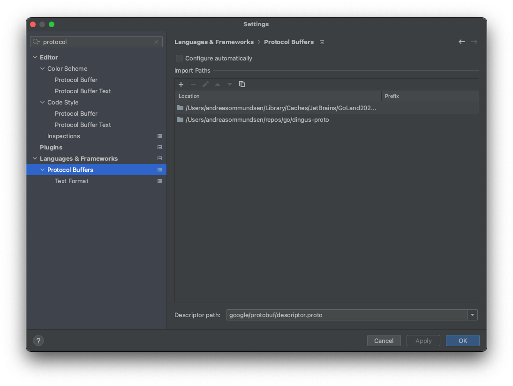
Otherwise, the proto files will not be able to import each other.

Use the Makefile to generate/update the proto files:
That is, in the terminal at project root write `make proto`

Protocol Buffers Docs: https://protobuf.dev/

gRPC Docs: https://grpc.io/docs/what-is-grpc/core-concepts/

Use [Kreya](https://kreya.app/) while waiting for Postman to get a proper take on gRPC.

How To Use Kreya

Click Create Projects.\
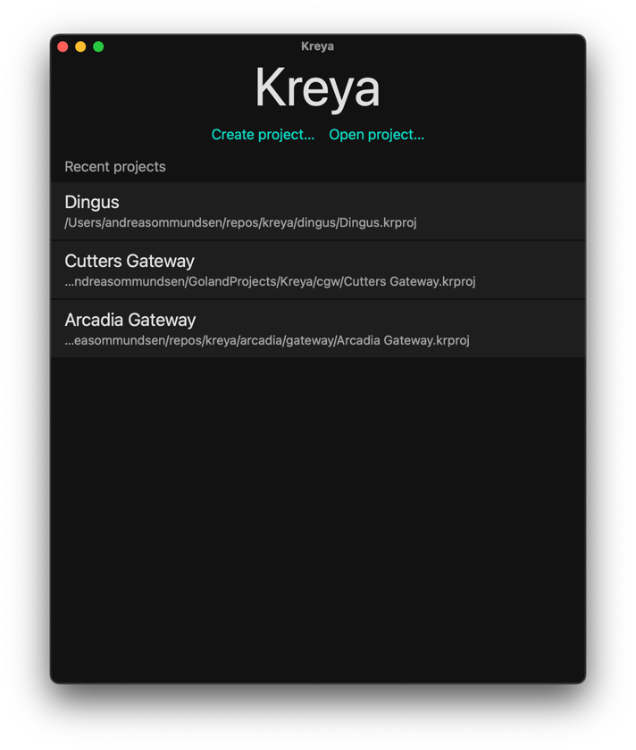

Click Select Location.\
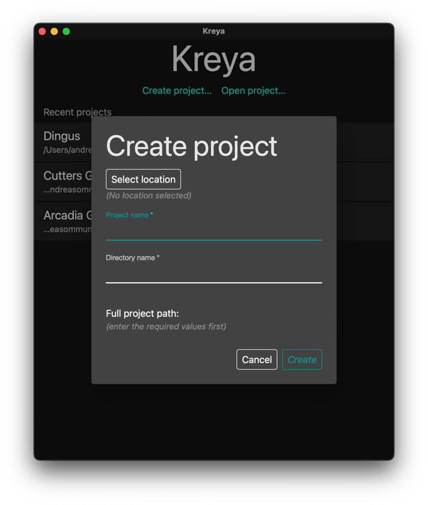

Select a directory where you want to keep your Kreya projects.\
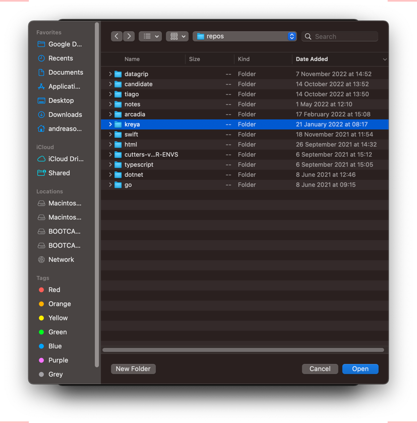

Fill in the remaining fields. Please note the Full project path at the bottom.\
Click Create.\
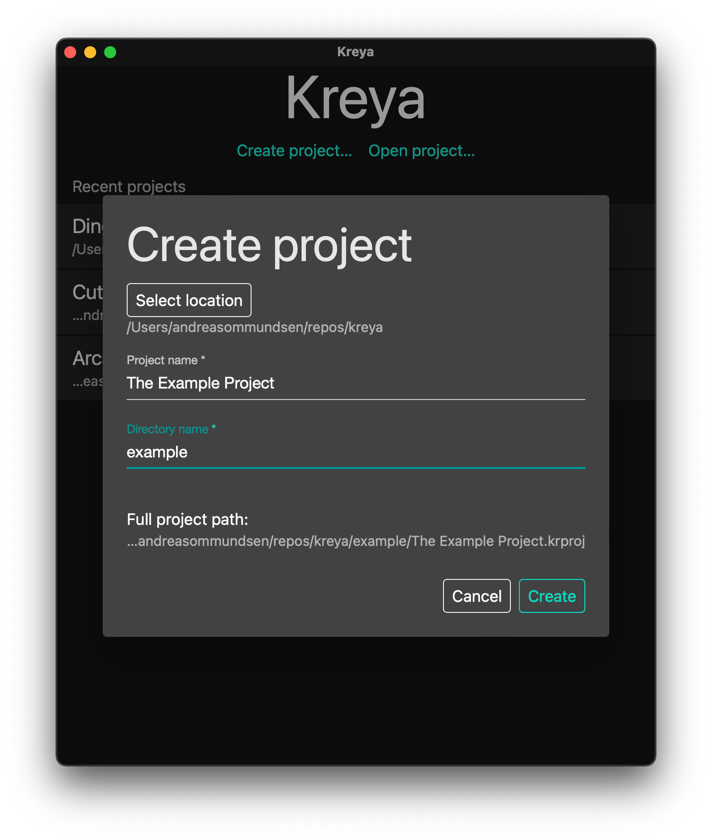

Choose "gRCP proto files", then click "Add proto directory".\
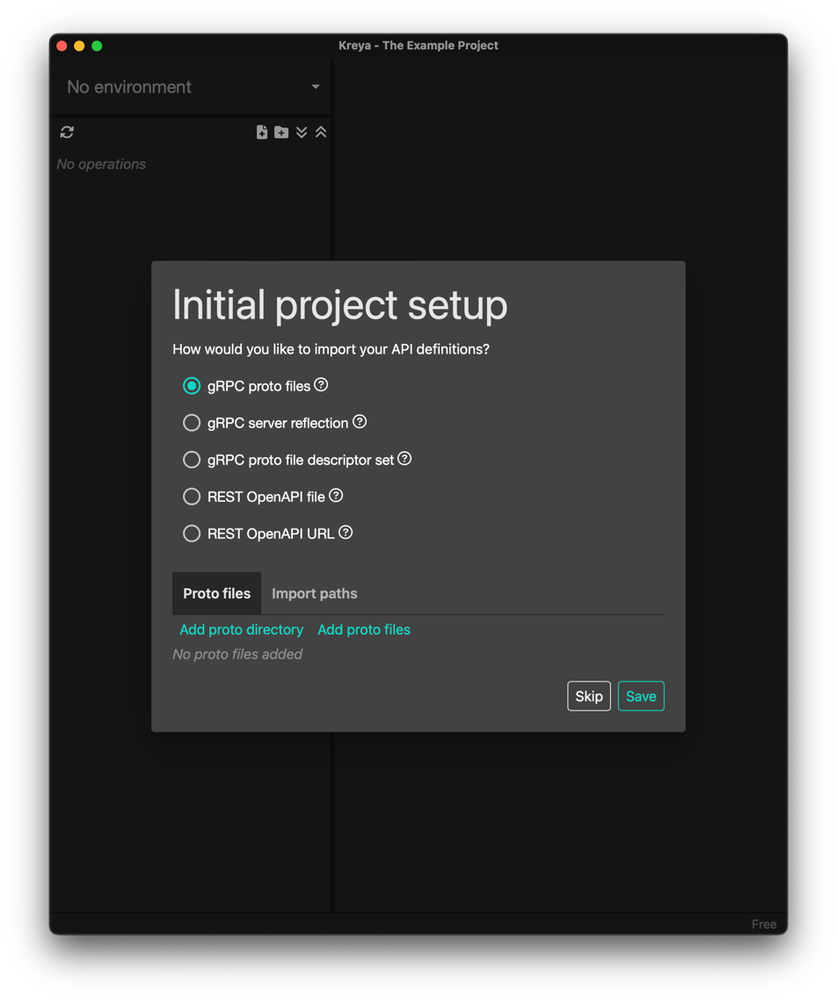

Select the project root where you keep the proto files, then click Save.\
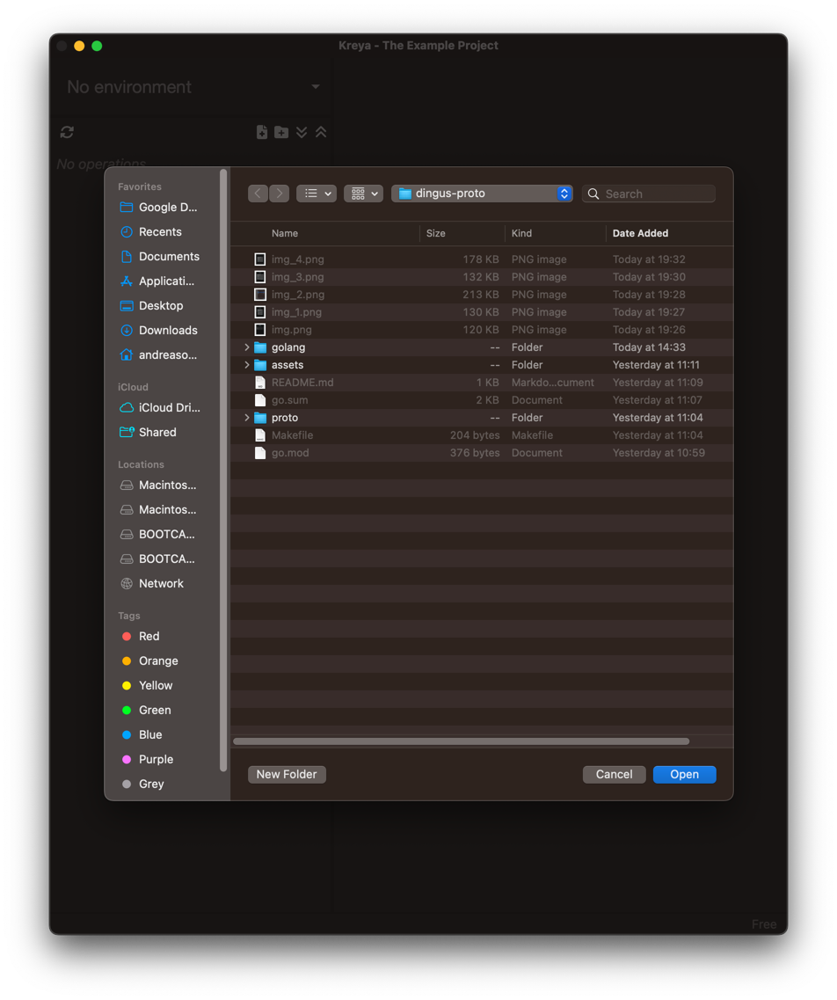

Kreya should now have imported any proto files it found, see the picture.\
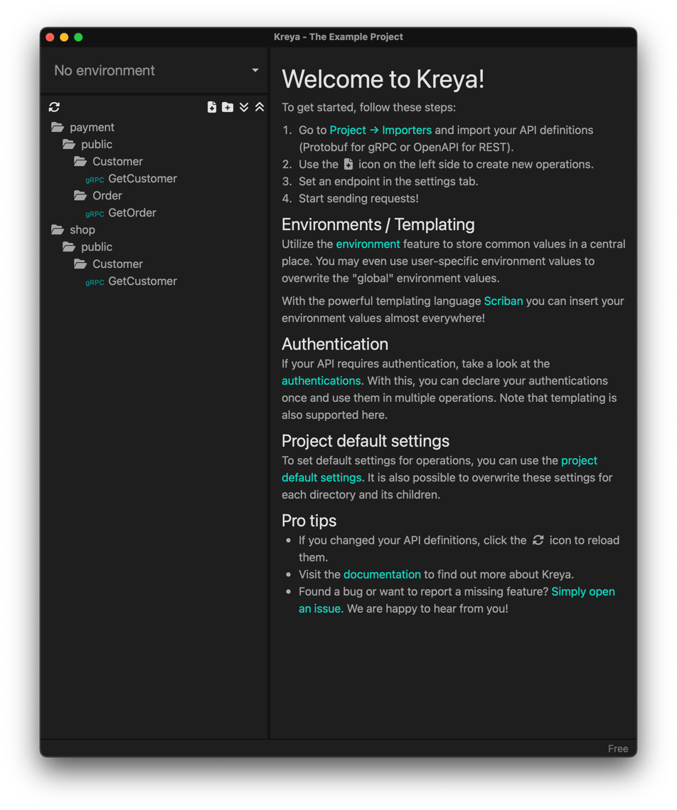

Now you need to add an environment. Let's start with one for local development.\
Select Project > Environments from the menu bar.\
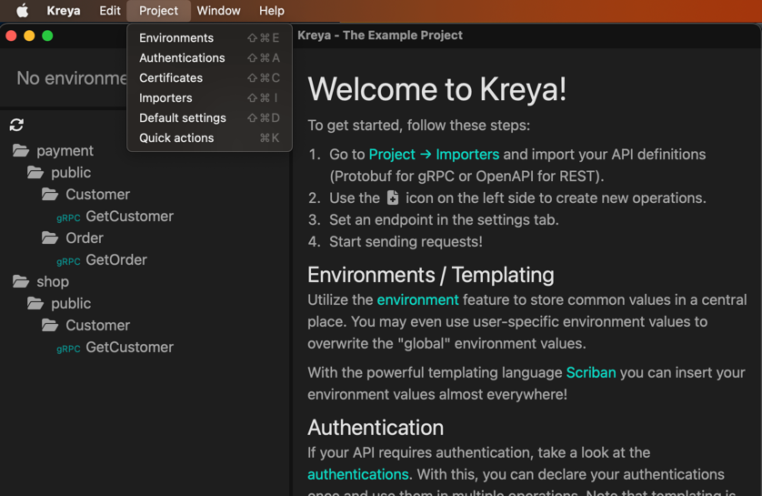

Click "New environment" and then in the General tab name it Local.\
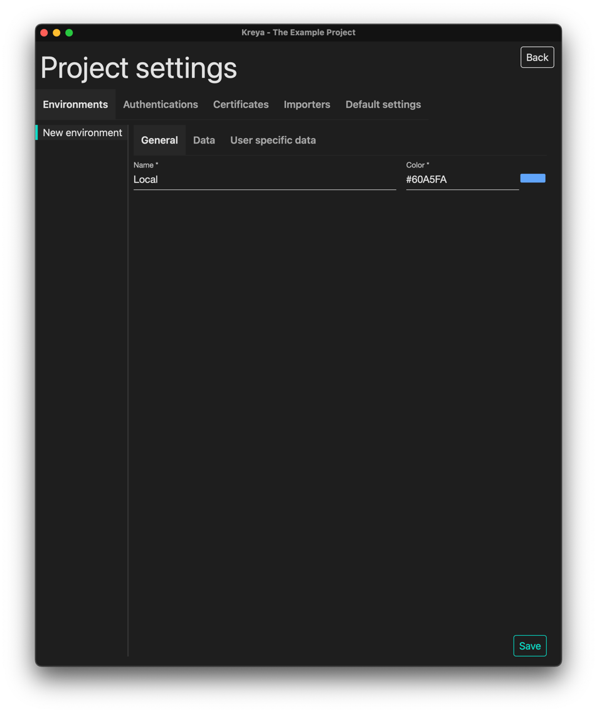

Now click the Data tab. This is where you'll store variables in a JSON.\
Here's an example of two different variables that we'll shortly.\
Click Save, then Click Back in the top right corner.\
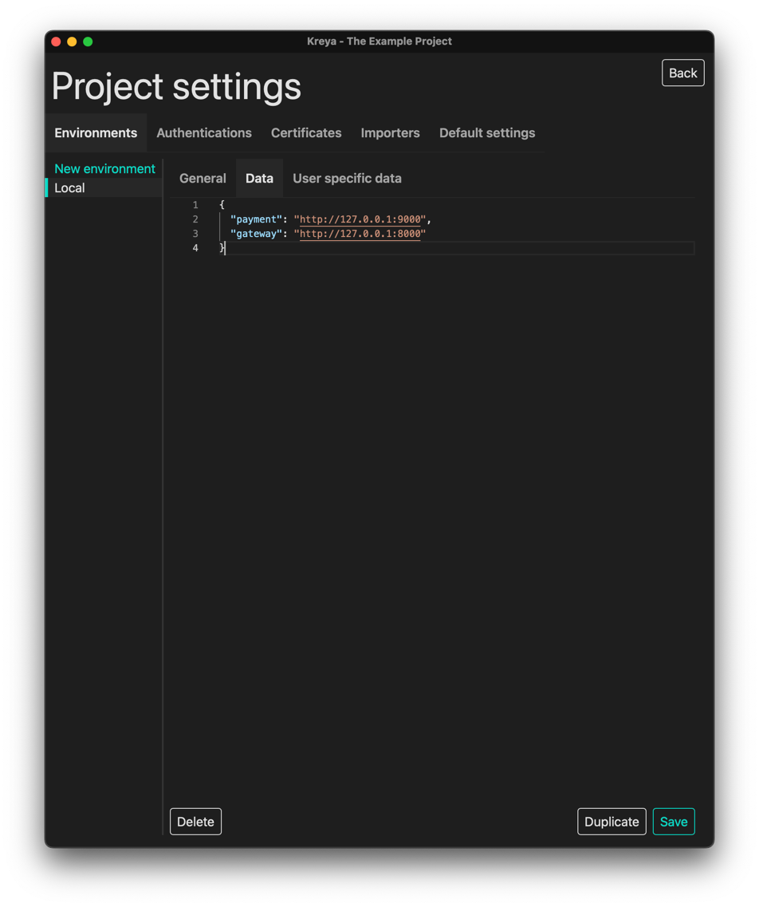

Select the topmost directory, here "payment".\
Click the drop-down for default settings and choose "Local".\
Then select the "Endpoint" box and fill in as shown in the picture.\
This is how you use the variables from the environment.\
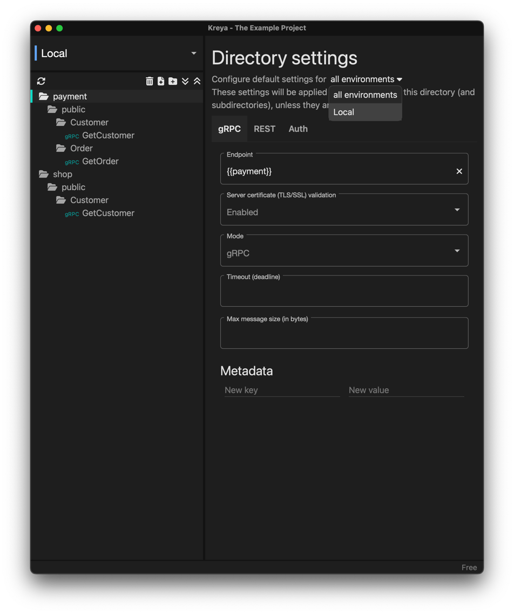

Do the same for the "shop" directory, but this time using the {{gateway}} variable.\
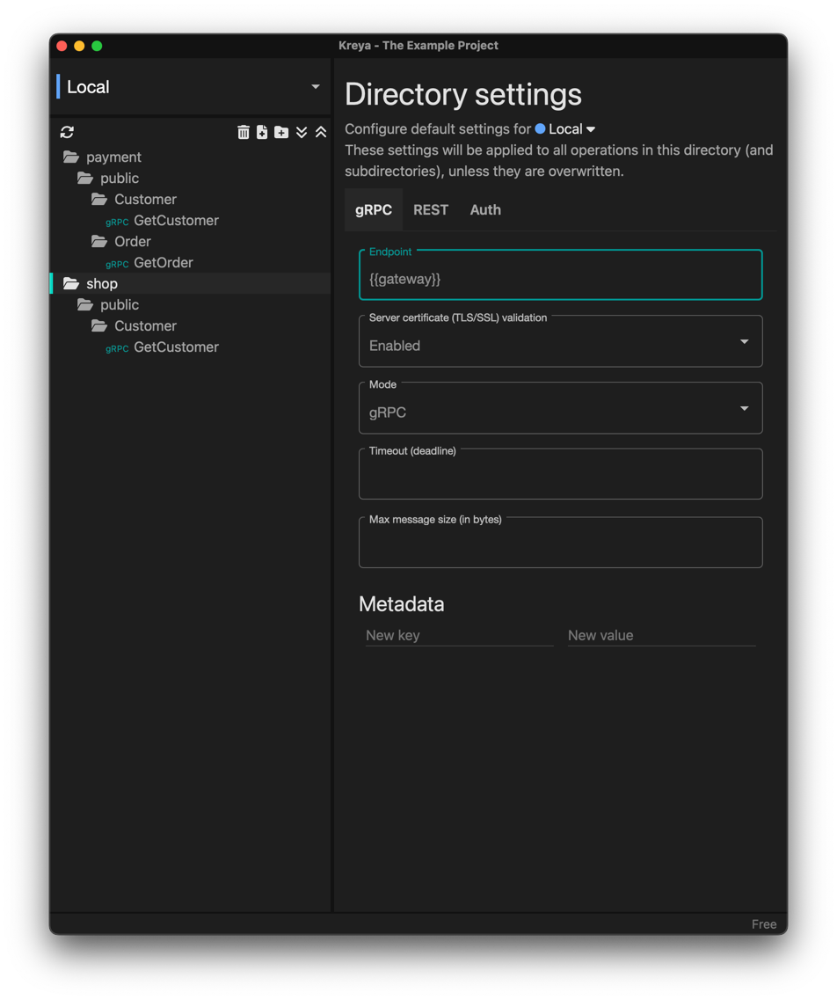

`That's it! You should now be able to send gRPC requests!`

